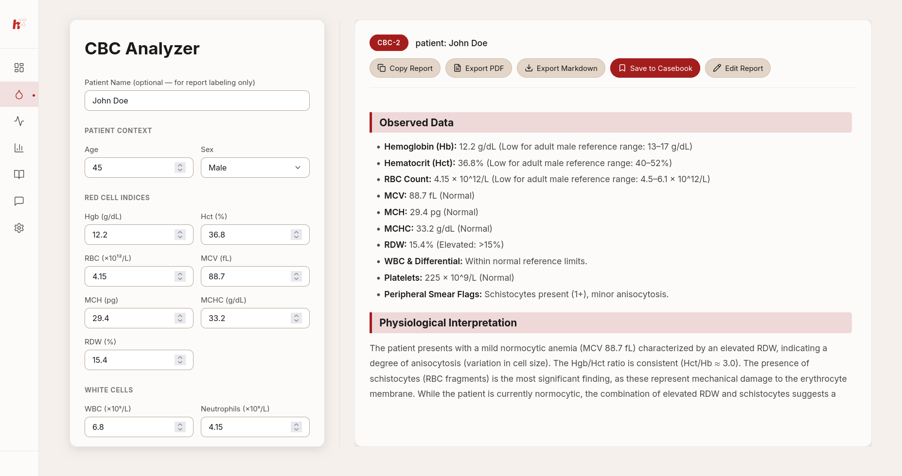
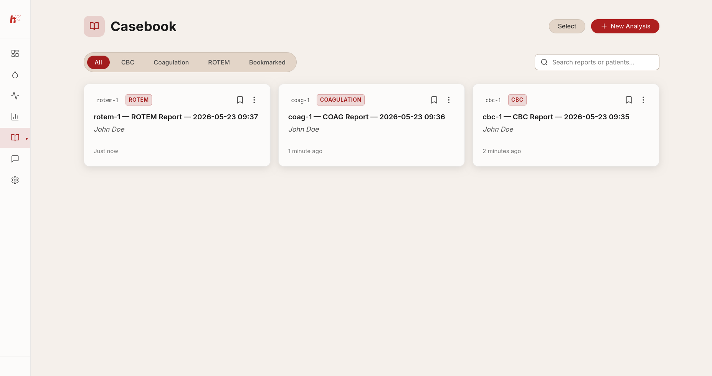
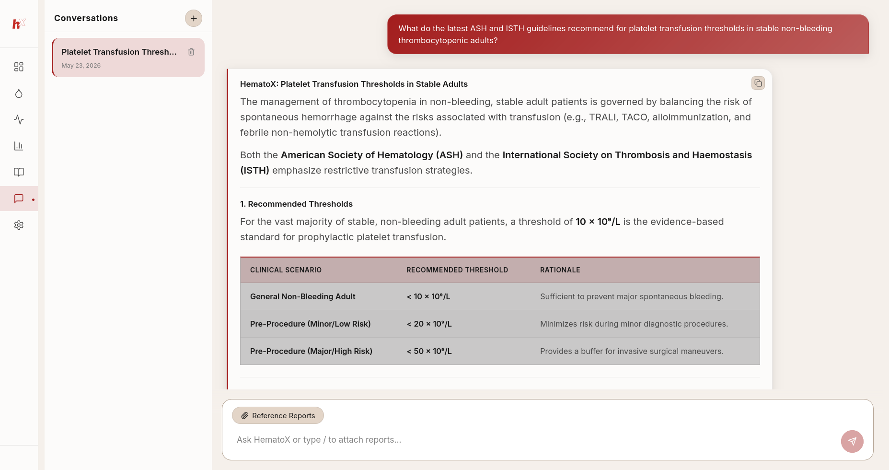
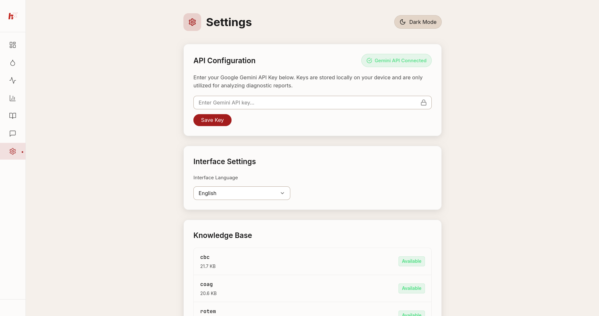

<div align="center">


**Local-first hematology reasoning engine for medical education**

[](https://python.org)
[](https://react.dev)
[](https://fastapi.tiangolo.com)
[](https://vitejs.dev)
[](LICENSE)
[Features](#-features) · [Architecture](#-architecture) · [Installation](#-installation) · [Usage](#-usage) · [Troubleshooting](#-troubleshooting) · [Contributing](#-contributing)

> ⚠️ **Medical Disclaimer:** HematoX is strictly for **educational and research use**. It is **not** a clinical diagnostic tool. All outputs must be reviewed by a qualified clinician. Never use for treatment decisions.

</div>

---

## What is HematoX?

HematoX is a **privacy-first, locally-hosted** web application for hematology reasoning and education. It accepts structured clinical lab inputs — CBC, coagulation panels, and ROTEM/TEG parameters — and uses the **Gemini API** to generate detailed, guideline-anchored interpretations.

Everything runs on your machine. No cloud sync. No accounts. No patient data leaves your computer.

---

## Features

| Module | Description |
|--------|-------------|
| **CBC Analysis** | Complete Blood Count interpretation with differential, flags, and clinical context |
| **Coagulation Panel** | PT, aPTT, fibrinogen, D-dimer, and mixing studies interpretation |
| **ROTEM / TEG** | Viscoelastic hemostasis testing analysis with component-level breakdown |
| **AI Chat** | Context-aware hematology assistant with access to your generated reports |
| **Casebook** | Persistent, searchable archive of all generated reports |
| **PDF Export** | Clean, typeset PDF export of any report |
| **Settings** | Configure your Gemini API key directly in the UI — no terminal needed |

### Privacy First

- **Fully local** — backend and frontend run on `localhost`
- **No telemetry** — zero analytics, tracking, or external calls (except Gemini API)
- **Your data stays yours** — SQLite database lives on your own machine
- **No account required** — open and use immediately

---

## Architecture

```
HematoX/
├── backend/                   # Python / FastAPI
│   ├── main.py                # App entrypoint, lifespan, middleware
│   ├── database.py            # Async SQLite via aiosqlite
│   ├── migrations.py          # Safe schema migrations
│   ├── gemini_client.py       # Gemini API wrapper
│   ├── corpus_loader.py       # Loads clinical guideline Markdown
│   ├── prompt_builder.py      # Assembles structured prompts
│   ├── logger.py              # Rotating JSON structured logger
│   ├── sanitizers.py          # Input sanitization utilities
│   ├── validators.py          # Input validation schemas
│   ├── middleware.py          # Request-ID correlation middleware
│   └── routers/
│       ├── analyze.py         # POST /api/analyze — core analysis
│       ├── reports.py         # GET/PATCH /api/reports — casebook
│       ├── chat.py            # POST /api/chat — AI chat sessions
│       ├── settings.py        # GET/POST /api/settings — configuration
│       └── export.py          # GET /api/export — PDF generation
│
├── frontend/                  # React / Vite / Tailwind
│   └── src/
│       ├── pages/             # CBC, Coag, ROTEM, Chat, Casebook, Settings
│       ├── components/        # Sidebar, Layout, ReportOutput, ChatWorkspace…
│       ├── context/           # Language, Theme, Toast providers
│       ├── hooks/             # useBreakpoint, useScrollLock
│       ├── api/               # Axios client configuration
│       └── design/            # CSS design tokens
│
├── corpus/                    # Clinical reference Markdown files
│   ├── cbc_guidelines.md
│   ├── coag_guidelines.md
│   └── rotem_guidelines.md
│
├── fonts/                     # Embedded TeX Gyre Termes (PDF export)
├── logs/                      # Rotating application logs (gitignored)
├── start.py                   # One-command cross-platform launcher
├── requirements.txt           # Python dependencies
└── .env.example               # Environment variable template
```

**Request flow:**
```
Browser (React) → Vite dev proxy → FastAPI (port 8000)
                                     ↓
                              corpus_loader + prompt_builder
                                     ↓
                              Gemini API (external)
                                     ↓
                              SQLite (hematox.db)
```

---

## Screenshots

| | |
|---|---|
|  |  |
| **CBC Analysis** | **Casebook** |
|  |  |
| **AI Chat** | **Settings** |

---

## Tech Stack

| Layer | Technology |
|-------|-----------|
| Frontend framework | React 18 |
| Build tool | Vite 5 |
| Styling | Tailwind CSS 3 |
| Animations | Framer Motion |
| Icons | Lucide React |
| HTTP client | Axios |
| Markdown rendering | react-markdown + remark-gfm |
| Backend framework | FastAPI |
| ASGI server | Uvicorn |
| Database | SQLite via aiosqlite |
| AI model | Google Gemini (via `google-genai`) |
| PDF generation | ReportLab + Pillow |
| Logging | Python stdlib (rotating JSON) |

---

## Requirements

| Requirement | Version |
|-------------|---------|
| Python | 3.10 or higher |
| Node.js | 18 or higher |
| npm | 9 or higher |
| Gemini API key | Free tier works |

Get a free Gemini API key at [aistudio.google.com](https://aistudio.google.com/app/apikey).

---

## Installation

### Option A — Automatic (recommended)

The `start.py` launcher handles everything: dependency installation, service startup, and browser launch.

```bash
# 1. Clone the repository
git clone https://github.com/your-username/HematoX.git
cd HematoX

# 2. (Optional) Set your Gemini API key in advance
cp .env.example .env
# Edit .env and paste your key: GEMINI_API_KEY=AIza...

# 3. Launch
python start.py
```

The launcher will:
- Detect your OS
- Check Python and Node.js versions
- Install Python and npm dependencies automatically
- Start backend and frontend
- Open your browser automatically

> 💡 **No API key yet?** You can skip step 2 and set the key later inside the app under **Settings → Gemini API Key**.

---

### Option B — Manual setup

```bash
# 1. Clone
git clone https://github.com/your-username/HematoX.git
cd HematoX

# 2. Python environment (recommended: virtual env)
python -m venv .venv

# Activate — Linux / macOS:
source .venv/bin/activate

# Activate — Windows (PowerShell):
.venv\Scripts\Activate.ps1

# 3. Install Python dependencies
pip install -r requirements.txt

# 4. Configure environment
cp .env.example .env
# Open .env and add: GEMINI_API_KEY=AIza...

# 5. Install frontend dependencies
cd frontend
npm install
cd ..

# 6. Start backend (leave this terminal open)
uvicorn backend.main:app --reload --port 8000

# 7. Start frontend in a NEW terminal
cd frontend
npm run dev

# 8. Open browser
# → http://localhost:5173
```

---

## Usage

### First-time setup checklist

- [ ] App opens at `http://localhost:5173`
- [ ] Navigate to **Settings** and enter your Gemini API key
- [ ] Run a test CBC analysis with sample values
- [ ] Confirm a report appears in the **Casebook**

### Running an analysis

1. Select a module from the sidebar (CBC, Coagulation, or ROTEM)
2. Enter lab values in the form
3. Optionally add a patient label or clinical notes
4. Click **Analyze**
5. Review the AI-generated interpretation
6. Save to Casebook or export as PDF

### Chat assistant

The Chat page gives you access to a hematology-focused AI assistant. You can reference saved reports from your Casebook directly in the chat for contextual Q&A.

### Corpus customization

Clinical knowledge is loaded from plain Markdown files in `corpus/`:

```
corpus/
├── cbc_guidelines.md       ← Edit to update CBC reference material
├── coag_guidelines.md      ← Coagulation reference
└── rotem_guidelines.md     ← ROTEM/TEG reference
```

Restart the backend after editing corpus files.

---

## Troubleshooting

### Backend won't start

```bash
# Check Python version (must be 3.10+)
python --version

# Re-install dependencies
pip install -r requirements.txt

# Check for port conflicts
# Linux/macOS:
lsof -i :8000
# Windows:
netstat -ano | findstr :8000
```

### Frontend won't start

```bash
cd frontend

# Clear npm cache and reinstall
rm -rf node_modules package-lock.json
npm install

# Check Node version (must be 18+)
node --version
```

### "GEMINI_API_KEY not configured" error

Set your key via the **Settings** page in the app, or add it to your `.env` file:
```
GEMINI_API_KEY=your_api_key_here
```

### Database errors on first launch

The database is created automatically. If it appears corrupt:
```bash
# Delete and let the app recreate it
rm hematox.db
# Restart the backend — tables are re-created on startup
```

### CORS errors in browser console

Ensure the backend is running on port 8000 and the frontend on port 5173. Both must be active simultaneously.

### Logs

```bash
# Live backend log
tail -f logs/app.log | python -m json.tool

# Filter by request ID
grep "your-request-id" logs/app.log
```

---

## Environment Variables

| Variable | Default | Description |
|----------|---------|-------------|
| `GEMINI_API_KEY` | _(empty)_ | Google Gemini API key. Can also be set via Settings UI. |
| `CORS_ORIGINS` | `http://localhost:5173` | Comma-separated allowed origins |
| `LOG_JSON` | `false` | Set to `true` for JSON console output |

---

## Contributing

Contributions are welcome! HematoX is an educational project — improvements to clinical accuracy, UI/UX, and documentation are especially appreciated.

```bash
# Fork and clone
git clone https://github.com/your-username/HematoX.git
cd HematoX

# Create a feature branch
git checkout -b feature/your-feature-name

# Run tests before committing
python -m pytest --tb=short -q

# Push and open a pull request
git push origin feature/your-feature-name
```

### Running tests

```bash
# All tests
python -m pytest

# With coverage report
python -m pytest --cov=backend --cov-report=term-missing

# Specific test file
python -m pytest backend/test_analyze.py -v
```

### Code style

- Python: PEP 8, type hints preferred
- JavaScript/React: functional components, hooks, no class components
- Commits: conventional commits format (`feat:`, `fix:`, `docs:`, etc.)

---

## Project Structure Notes

- `corpus/` — Clinical reference Markdown. Replace with your own guidelines.
- `fonts/` — TeX Gyre Termes fonts for PDF export. Do not delete.
- `logs/` — Log directory. `.gitkeep` is committed; log files are gitignored.
- `backend/test_*.py` — Test suite. Run before any pull request.
- `design.md` — Internal design system reference. Not required for usage.

---

## License

This project is source-available.

You may use, study, and modify it for personal or educational
purposes only.

Commercial use is prohibited without permission.

Please give credit if you build upon this project.

See [LICENSE](LICENSE) for details.

---

## ⚠️ Medical Disclaimer

**HematoX is not a medical device and is not intended for clinical use.**

- All AI-generated interpretations are for **educational purposes only**
- Outputs must be reviewed by a **qualified healthcare professional**
- Never use HematoX to guide patient treatment decisions
- The developers assume no liability for clinical misuse

---

<div align="center">

Made for medical education · Runs entirely on your machine · No data leaves your computer

</div>
